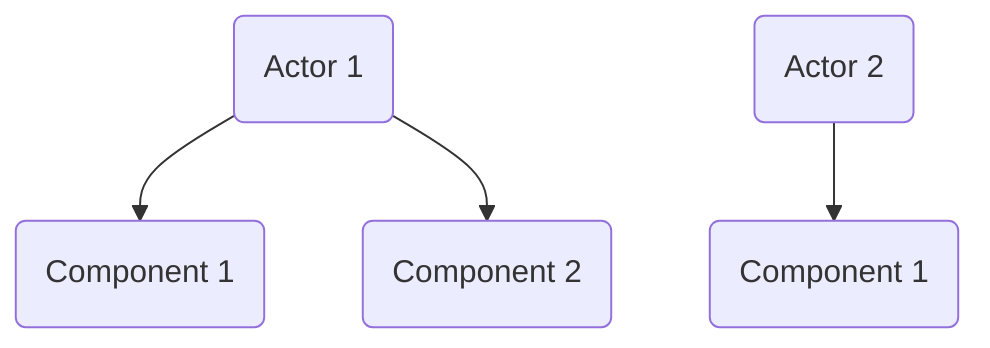
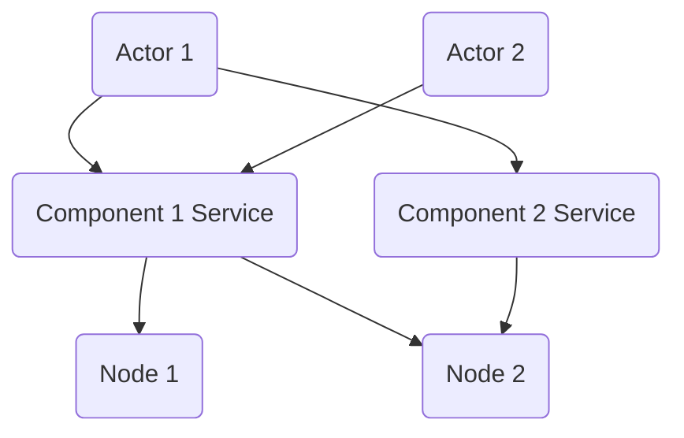

# Implementation Architecture

!!! note
    This is just a tentative design.

## Architecture Choices

There are several schemes to implement the Entity-Component-System (ECS) architecture.

### One Container Per Actor

This is the easiest scheme to think of.
In this scheme,
each actor is associated with a single container,
and all components in that actor are isolated in that container.

**Pros:**

- Each actor with its components is isolated,
and failure within one actor does not affect the others.
- There is minimal communication cost between multiple components on a single actor.

**Cons:**

- Even though the number of components is limited,
the number of possible combinations,
and hence the number of actor types,
can be potentially large.
If we were to create an image for each actor with a different set of components,
the number of docker images would blow up.

### One Service Per Component

In this scheme,
each type of component is implemented as a service
which automatically load-balances across multiple nodes
as the number of actors using this component grows.
All actors using the same type of component
connects to the same service endpoint.

#### General Architecture

Physically, each type of component is exposed as a service
which may be deployed over one or multiple nodes.
The idea is, component services are guaranteed to be always available,
and scales automatically with the number of actors using them.

For example, consider a multi-agent system:

The implementation might look like:

#### Component Service Implementation

To ensure isolation across different component instances,
each instance of a component is encapsulated in its own process.

**Pros:**

- Scales to large number of actors with different combinations of components.

**Cons:**

- It can be hard to ensure isolation between
  different instances of the same component type
  attached to different actors,
  especially when those instances are deployed on the same node.
- Each inter-component event requires a round-trip over the cluster network,
  even for the components on the same actor.

### Runtime Component Injection

This scheme is similar to "One Container Per Actor",
in that each actor gets its own container.
The difference is that instead of creating an image
for each different combination of components,
there is only one image providing the basic functionalities
like event passing.
When an actor is spawn,
a container is created,
then the components are injected into the container.

The critical design choice with this architecture is
how to package the runtime code for each component.
Apparently, we want something more lightweight than a container
since the components are already running in a container.
May look into existing sandboxing solutions like snap and AppImage.

In general, the means of component packaging/virtualization should:

1. Be lightweight;
2. Ensure isolation between different components on the same actor.

**Pros:**

- Ensures isolation between different actors.
- Keeps the number of packages at a minimum
even when there are a large number of actors
with different combinations of components.

**Cons:**

- The process of component injection can introduce unexpected bugs.
For example, if two components use the same temporary directory in the host container,
they may interfere with each other and cause unwanted behavior even if they have no bugs on their own.
