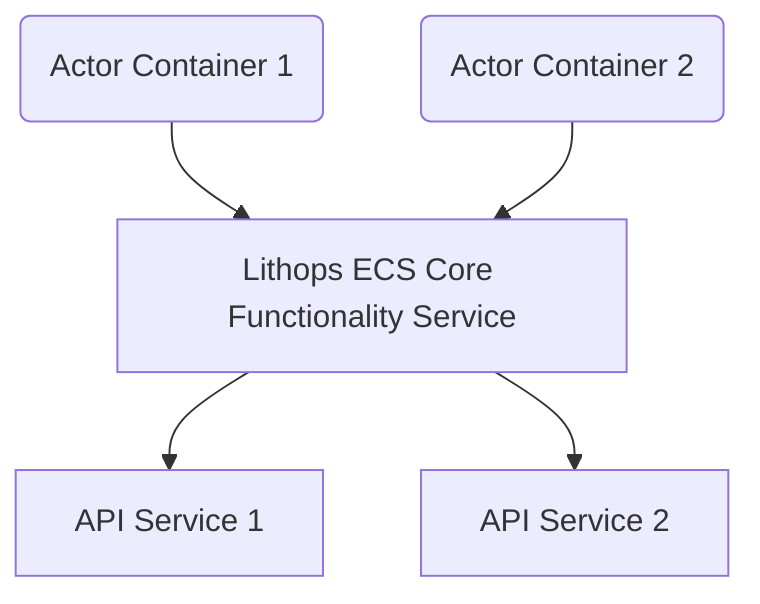
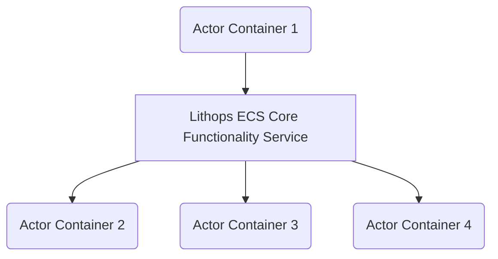
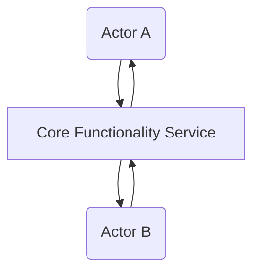
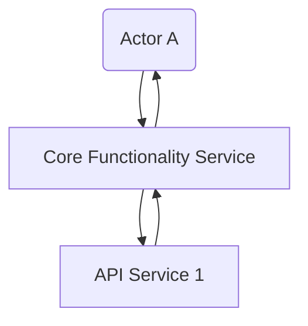

# Lithops Distributed ECS Implementation Architecture

This document discusses the high-level architecture
that Lithops employs to implement
large scale, distributed and decentralized entity-component systems.

## Architecture Overview

Lithops employs the runtime component injection architecture
for implementing distributed ECS
and adds an abstraction named "service"
for implementing API services that need load-balancing,
such as image generation.

There are four core concepts in the ECS architecture.

### Actor

Each actor with all its components runs as a container.
An actor is assumed to be relatively lightweight
and can fit on a single machine.

### Component

Each component runs as a self-contained, sandboxed package inside the actor container.
When an actor is spawned, the actor container is created,
then the component packages are pulled and run.

### Service

A service is a load-balanced API service endpoint
providing stateless, potentially heavily-depended API services,
such as text and image generation.

### Core Functionality Service

This is a core functionality service endpoint
(deployed and load-balanced automatically)
that all actors/components use
to access Lithops ECS core functionalities.

All communications, event passing and API calls
are proxied through this service.

## Host Image API

The host image refers to the base image of the actor container.
This does not include any components but must provide syscall-like APIs
that the components use to implement their functionalities.

For the MVP, we provide a minimal set of APIs
that are used the most frequently in a well-structured game project:

- Get component by class (gets the first component of the given type);
- Find component by class and tag.

For reference, a tag is a semantic string
associated with either a component or an actor.
Each component or actor can have multiple tags.
In game development,
a component use tags to find
other components it depends on.

## Component SDK API

Component SDK API refers to the APIs that
component code uses to access
the syscall-like entity-component system core functionalities.

This includes:

- Sending and receiving events to/from other components,
either on the same or different actors.
- Calling exposed APIs on other components/services.

In Lithops, we organize such APIs in an object-oriented manner
similar to game engines.
Specifically:

- Component code can get handles to actors,
components or services.
- These handles expose APIs such as
sending events, binding event dispatchers
and calling APIs
(similar to calling public functions
on other actors/components in game engines).
- These handles automatically handle the cases where
actor/components fail and restart.

## System Implementation Overview

On a lower level,
a running ECS system may look like the following:

In the diagram above,
the nodes with rounded corners are lightweight containers
and those with squared corners are load-balanced service endpoints.

On a lower level,
all communications happen through the core functionality service.
For example, if an actor wants to broadcast an event to the bound listeners,
the process may look like this:

More specifically, the event broadcast process happens in these steps:

1. An entity (either an actor or a component)
tells the core functionality service
that it would like to broadcast an event.
2. The core functionality service
looks up the listeners
and sends the event to each of them.
3. Optionally, the core functionality service
may return two handles to the entity initiating the broadcast,
one for signaling when all receiving entities have received the event,
and another for when they have finished processing it.

The core functionality service
keeps a list of logical listeners
as well the entity initiating the broadcast in a database.
This ensures that the event broadcast is guaranteed to success
even when one or more receiving entities fail and must be restarted.

Calling an API on another actor/component happens in a similar fashion.
For example, if actor A wants to call an API on actor B:

- Actor A tells the core functionality service to call an API with certain parameters on actor B.
- The core functionality service takes the query and calls the API endpoint on actor B.
- Actor B returns a response and the core functionality service forwards it back to actor A.

Such a process is illustrated in the following diagram:

It is a deliberate design that
everything involving another actor/component
must go through the core functionality service.
This ensures that actor container failures and restarts are handled properly
and component code can reference logical actors
which are assumed to be always available.

API calls to load-balanced API services happen in a similar fashion.
All API calls to load-balanced services like image generation
are proxied through the core functionality service, like this:

Everything looks the same as calling an exposed API on an actor/component,
except that the callee is a load-balanced service, not a container.
